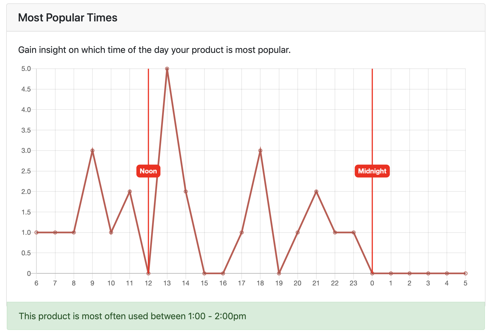
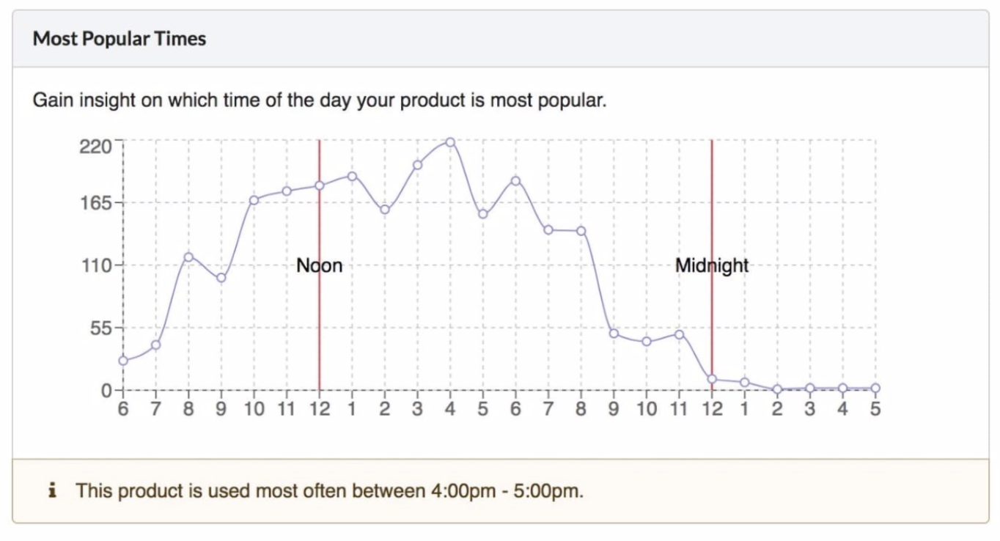

# Frontend Challenge

## Code

My assessment code can be accessed by going to `views > index.jade`.

## Testing

To test the code, you need to start a local node server. It is important that you have Node.js installed on your machine:
```
https://nodejs.org/en/download/
```


Once you have done that and cloned the project on your computer, you need to install the server dependencies with:
```
npm install
```


After that, you can run the node server with:
```
npm start
```


This should pop up a window in your browser with a web address: 
```
localhost:3000
```

## Result

In the window, you should see a graph that looks like this:




Below is the graph that needed to be resembled as per the assessment guidelines:




## Developers Note

This was my first time working with Node.js, Express, Jade, and the Chart.js library. It was a very rewarding experience and I learned a lot in the process!


However, due to time constraints, there are some improvements that need to be made:

- [ ] Find a way to have 12-hour time charted on the x-axis as detailed in the example graph.
     
     
     *Chart.js does not allow for vertical lines to be drawn on labels of the same value on the x-axis*
    
    
- [ ] Continue learning about Express/Jade to be able to interpolate the Javascript data in the section of the graph that details when the product is most often used.


     *Although I had the proper variable values to interpolate the data, I had to hardcode the answer as I was unable to interpolate the data properly.*
